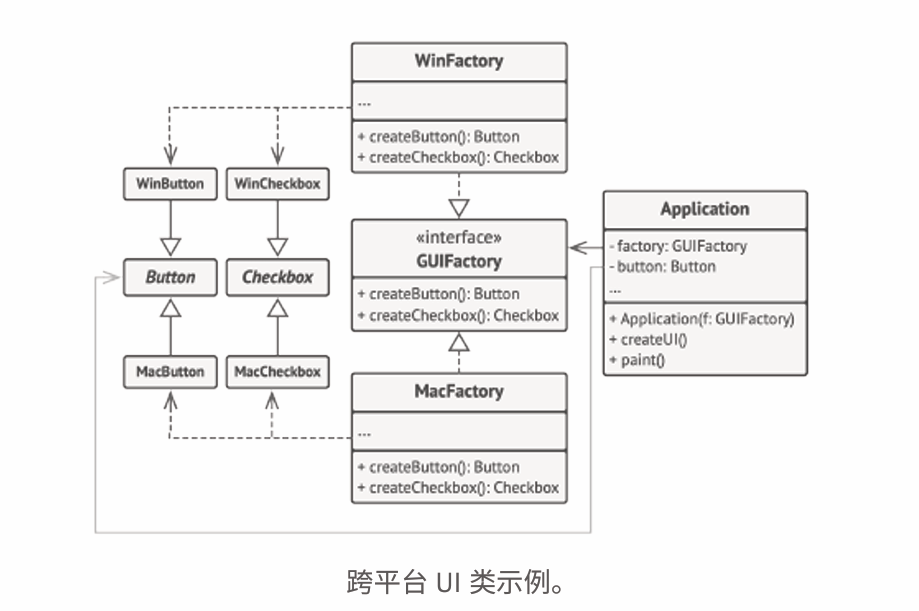

# Abstract Factory 抽象工厂模式

## 场景

**AI-Integration**
  可以抽象出若干个产品：会话、一次性交互消息、画图等等。
  其中每种产品可以看作具有几种不同的风格：coze、openAi、百度诸如此类。
未来会涌现出更多的大模型产品（即产品风格）、或者更多的面向用户接口的交互形式。

## 概念
From <<深入设计模式>>
**1. 抽象产品**： abstract product 一系列产品中，一组不同但是相关的产品声明接口。

**2. 具体产品**：concrete product 对于抽象产品的不同实现。

**3. 抽象工厂**：abstract factory 声明一组各种创建抽象工厂的方法。 

**4. 具体工厂**：concrete factory 实现抽象工厂的构建方法。具体工厂和具体产品一一对应。

[^1]: From <<深入设计模式>>

demo: 跨平台应用客户端

## 生长思考

1. 对比工厂方法模式和抽象工厂模式

工厂方法模式只有一种产品，但是
